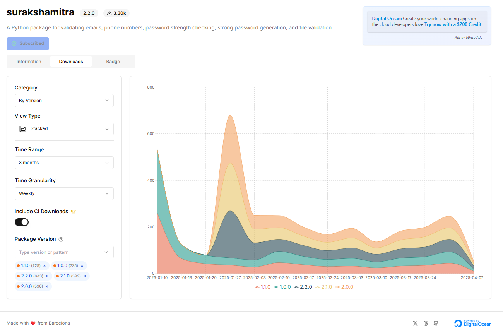

# SurakshaMitra

SurakshaMitra 🔐 is your security companion for managing passwords 🔑 and validating email 📨 addresses as well as file uploader 🗃️ and phone 📞 validatore. 

## Features ☕

- Check password strength 💪🏻
- Generate strong passwords ♨️
- Validate email addresses 📧
- Validate Phone Numeber 📞 
- Validate valid file upload 🗃️


## Total Downloaders



## Installation

Install SurakshaMitra using pip:

```bash
pip install SurakshaMitra
```

## Usage


## 1. Check Password Strength
To check the strength of a password, use the check_strength() function:

```bash
from SurakshaMitra.password_strength import check_strength

password = "YourPassword123!"
result = check_strength(password)
print(result)
```
### output
This will output the strength of the password as one of the following categories:

-Weak

-Average

-Medium

-Strong

-Very Strong


## 2. Generate Strong Passwords
To generate a strong password, use the generate_password() function:

```bash
from SurakshaMitra.password_generator import generate_password

password = generate_password(length=12)  # Specify the length of the password
print("Generated Password:", password)
```

### output
This will generate a random, strong password with a mix of characters, numbers, and special symbols.


## 3. Validate Email Address
To validate an email address, use the validate_email() function:

from SurakshaMitra.email_validator import validate_email

```bash
email = "example@example.com"
is_valid = validate_email(email)
if is_valid:
    print(f"{email} is a valid email address.")
else:
    print(f"{email} is not a valid email address.")
```

## 4. Validate Phone Number 📞
To validate a phone number for all countries, use the `validate_phone_number()` function:

```bash
from SurakshaMitra.phone_validator import validate_phone_number

phone_number = "+1 123-456-7890"  # Example number
is_valid = validate_phone_number(phone_number)
if is_valid:
    print(f"{phone_number} is a valid phone number.")
else:
    print(f"{phone_number} is not a valid phone number.")
```

### Output:
If the phone number is valid, it will return True, otherwise False.

# 5. Validate File Upload 📁
To validate file uploads based on size and file type, use the validate_file_upload() function:
```bash
from SurakshaMitra.file_upload_validator import validate_file_upload

file_path = "example.pdf"
allowed_types = ["pdf", "jpg", "png"]  # Specify allowed file extensions
max_size_mb = 5  # Set maximum file size in MB

is_valid = validate_file_upload(file_path, allowed_types, max_size_mb)
if is_valid:
    print(f"{file_path} is a valid file upload.")
else:
    print(f"{file_path} is not allowed.")
```
### Output:
This will check if the file meets the allowed types and size limit.


☕
For any issues or questions, feel free to raise an issue in the GitHub repository.


### Explanation:
- **Password Strength**: This demonstrates how to use the `check_strength()` function to evaluate the strength of a password.
- **Password Generator**: Shows how to use the `generate_password()` function to create a strong password.
- **Email Validator**: Guides the user to use `validate_email()` to check if an email address is formatted correctly.
- **Phone Number Validator**: Explains how the `validate_phone_number()` function checks if a phone number is valid for all countries.
- **File Upload Validator**: Demonstrates how `validate_file_upload()` ensures that uploaded files meet specific size and type restrictions.

## Contribution 🤝
We welcome contributions! Feel free to submit a [pull request](https://github.com/kashyapprajapat/SurakshaMitra/pulls) or open an [issue](https://github.com/kashyapprajapat/SurakshaMitra/issues) in our [GitHub repository](https://github.com/kashyapprajapat/SurakshaMitra).


